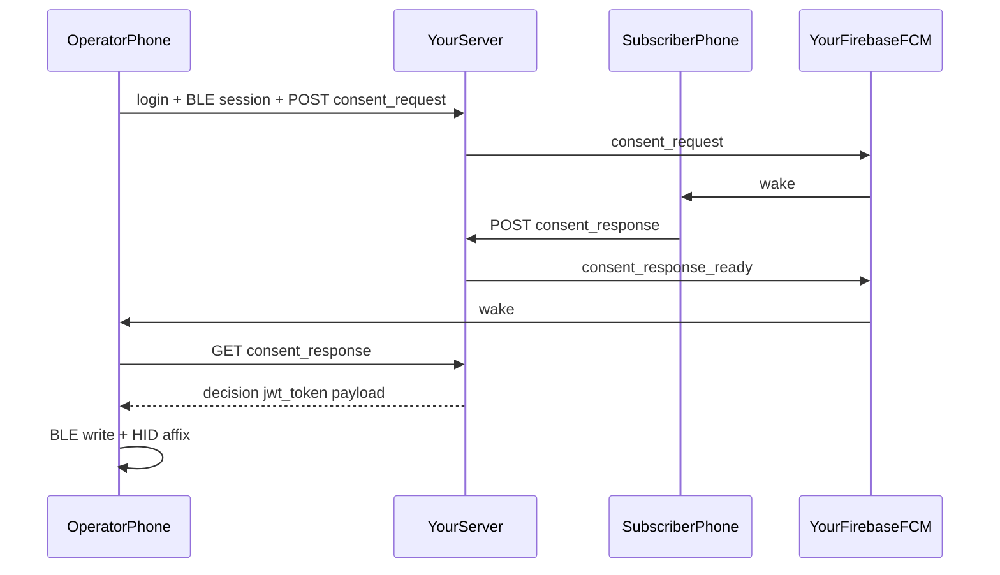

# Ascert.EN — Mobile Application Specification (Handoff Document)

**Purpose:** Give this file to another **Flutter / mobile developer** (or AI agent) so they can build the **exact Ascert.EN mobile app** and point it at **their own backend** (any stack), as long as that backend implements the API contract in this document.

**Product:** Ascert.EN / DTII — Phase-1 demo for consent + BLE witness (affixer) device flows in India digital identity.

**Audience:** Mobile engineer rebuilding the client from scratch.

**Companion:** If someone is building the server separately, also share `ASCERT_EN_SPRING_BOOT_SERVER_SPEC.md` (or equivalent). This document is **mobile-first** and includes the API the app expects.

---

## 0. Kickoff prompt (copy-paste)

```
Build the Ascert.EN Flutter mobile app exactly from ASCERT_EN_MOBILE_APP_SPEC.md.

Requirements:
- Flutter 3.x, Riverpod, go_router, Dio, flutter_blue_plus, Firebase Messaging
- Dark DTII UI (cobalt #005DF8, Ancorli headers, DMSans body)
- Roles: owner = Subscriber UI; operator = Operator UI (different bottom nav)
- BASE_URL configurable; must end with /api/v1 and talk to OUR server
- Own Firebase project: use OUR google-services.json
- Never put PIN/JWT in FCM handling expectations
- SER: list shows title; detail shows saved document name; operators never see SER
- Subscriber approve: biometric then client PIN gate 12345678 (not API-verified)
- Affix PIN for operator comes from GET /consent_response payload only
- Do NOT build website, blanket approvals, or change the documented API contract
```

---

## 1. Product roles and mental model

| API `role` | UI name | What they do in the app |
|------------|---------|-------------------------|
| `owner` | **Subscriber** | Login → dashboard consent list → review/approve/reject → SER (Subscriber Evidence Record) |
| `operator` | **Operator** | Login → BLE pair witness device → create consent + upload document → await decision → affix/inject PIN |



**Critical security UX rule:** FCM is **wake-only**. Decision JWT and owner affix PIN (`payload`) are fetched only over HTTPS `GET /consent_response/{id}`.

---

## 2. Tech stack (required)

| Layer | Choice |
|-------|--------|
| Framework | Flutter 3.x, Dart SDK `>=3.0.0 <4.0.0` |
| State | `flutter_riverpod` |
| Routing | `go_router` |
| HTTP | `dio` + Bearer JWT |
| Secrets | `flutter_secure_storage` |
| BLE | `flutter_blue_plus` |
| Permissions | `permission_handler` |
| Push | `firebase_core` + `firebase_messaging` + `flutter_local_notifications` |
| Biometrics | `local_auth` |
| Files | `file_picker` + `crypto` (SHA-256) |
| PDF | `syncfusion_flutter_pdfviewer` |
| Location (SER) | `geolocator` + `geocoding` |
| SER export | `path_provider` + `share_plus` |

### Suggested package IDs (change if rebuilding under another org)

| Platform | Value |
|----------|--------|
| Android `applicationId` | `com.dtii.ascent_en` (or your own — must match Firebase Android app) |
| iOS bundle | `com.dtii.ascentEn` (or your own) |
| pubspec name | `ascent_en` |
| App display name | `Ascert.EN` |
| Version | `1.0.0+1` / label `1.0.0-demo` |

---

## 3. Project layout (target)

```
lib/
  main.dart                 # Firebase init, error handlers, theme
  app_router.dart           # go_router routes
  constants/                # colors, fonts, assets, BASE_URL, PIN gate
  models/                   # user, consent, audit, ble packets
  providers/                # auth, session, audit, ble config, app_container
  services/                 # api, auth, ble, notifications, location, ser export
  screens/                  # all UI screens
  widgets/                  # AppScaffold, BLE widgets, dialogs
android/app/google-services.json   # YOUR Firebase Android config
assets/images/ ... fonts/ ...
```

---

## 4. Configuration the developer must own

### 4.1 `BASE_URL`

Single constant, must end with `/api/v1`:

```dart
const String BASE_URL = 'https://YOUR-HOST/api/v1';
```

All Dio calls are relative to this. Upload URLs are resolved by stripping `/api/v1` from the host (e.g. file at `/uploads/x.pdf` → `https://YOUR-HOST/uploads/x.pdf`).

### 4.2 Client-only subscriber PIN gate

```dart
const String HARDCODED_CONSENT_PIN = '12345678';
```

Used **only** after biometric on Subscriber **Approve**. **Not** sent to / verified by the server. The PIN the operator injects into the witness device comes from `GET /consent_response` → `payload` (owner’s cloud PIN).

### 4.3 Firebase (developer’s own project)

1. Create a Firebase project under **your** Google account.
2. Add an **Android** app with the same `applicationId` as the Flutter app.
3. Download `google-services.json` → `android/app/google-services.json`.
4. Enable Cloud Messaging.
5. Rebuild/reinstall the app after replacing the file.
6. Server (whoever builds it) needs a Firebase **Admin service account** to send pushes to tokens registered via `POST /devices/register`.

App notification channel id (must match server Android channel if set): **`ascent_en_consent`**.

You do **not** need Firebase Auth / Firestore for this app — only FCM.

---

## 5. Design system (exact)

### Colors

| Token | Hex | Use |
|-------|-----|-----|
| Cobalt | `#005DF8` | Primary accent, CTAs, active nav |
| Background | `#05051C` | Scaffold |
| Surface | `#1E1D1D` | Cards / surfaces |
| Card | `#111111` | List cards |
| Text primary | `#FFFFFF` | Headers / titles |
| Text muted | `#888888` | Captions |
| Border | `#242424` | Card borders |
| Pending | `#E8A030` | Status |
| Approved | `#22C55E` | Status |
| Rejected | `#EF4444` | Status |

### Typography

| Family | Use |
|--------|-----|
| **Ancorli** | Screen titles / section labels — headers, often CAPS, letter-spacing |
| **DMSans** | Body, buttons, list titles (Regular / Medium / Bold) |

SER screen title text: **`Subscriber Evidence Record`** in Ancorli (not the abbreviation alone).

### Chrome patterns

- Dark navy scaffold
- User greeting header (“Hello!” + name in Ancorli) + DTII logo on inside screens
- Cobalt 2px accent line under page titles
- Floating white pill bottom nav over cobalt hill graphic
- Floating snackbars; clear previous snackbar before showing a new one
- Soft errors (no aggressive red Material banners for cancel/wrong PIN)

### Brand assets (provide equivalents if rebranding)

- Full logo white/blue, icon white/blue
- Horizontal DTII lockup for login / app bar
- App launcher icon
- Fonts: `Ancorli-Regular.ttf`, `DMSans-Regular/Medium/Bold.ttf`

---

## 6. Navigation and screens

### Routes (`go_router`)

| Path | Screen | Who |
|------|--------|-----|
| `/splash` | Splash (~2.5s) → `/login` | All |
| `/login` | Email + password | All |
| `/dashboard` | Consent list + stats; operator also BLE status row | All |
| `/consent/:id` | Consent detail / decide | Both (deep link) |
| `/audit` | SER list | **Owner only** (operators redirect to dashboard) |
| `/ble` | BLE scan / session | Operator (owners blocked in UI) |
| `/ble/pin` | Affix / inject PIN | Operator |
| `/ble/rtc` | Device RTC sync | Operator |

### Pushed (not always in router)

| Screen | From | Purpose |
|--------|------|---------|
| Consent form | BLE session Ready | Operator creates request + document |
| SER detail | SER list row | Evidence fields |
| Attachment viewer | Consent detail | PDF/image preview |

### Bottom navigation

**Subscriber (`owner`):**

1. DASHBOARD → `/dashboard`
2. CONSENT → `/dashboard` (same list; do **not** hardcode a consent id)
3. SER → `/audit`

**Operator:**

1. DASHBOARD → `/dashboard`
2. BLE → `/ble`

Operators must **never** see SER in nav or usable `/audit`.

---

## 7. Auth and storage

### Login

1. `POST {BASE_URL}/auth/login` body: `{ "email", "password" }` (do **not** send role in production path).
2. Response:
```json
{
  "token": "<jwt>",
  "user": {
    "id": "USR-001",
    "email": "...",
    "name": "...",
    "role": "owner" | "operator",
    "deviceId": "DTI001"
  }
}
```
3. Persist in secure storage:

| Key | Value |
|-----|--------|
| `jwt_token` | JWT |
| `user_role` | `owner` \| `operator` |
| `user_id` | id |
| `user_name` | name |

4. Request notification permission → get FCM token → `POST /devices/register` `{ "fcmToken", "platform": "android" }` with Bearer token.
5. If a consent deep-link arrived while logged out, navigate to `/consent/{id}` after login.
6. Operator: load BLE device config from API, then go dashboard.
7. Logout: clear secure storage.

All authenticated calls: `Authorization: Bearer <jwt_token>`.

---

## 8. Subscriber consent review UX

1. Open via FCM `consent_request` or dashboard list → `/consent/:id`.
2. Show: title, description, attachment (tappable preview), document hash, operator location (if present), shared countdown to server deadline.
3. **Approve** only when role is `owner`, status pending, not expired:
   - Run `local_auth` biometric / device credential (cancel = silent, no error banner).
   - Then dialog for client PIN = `HARDCODED_CONSENT_PIN` (`12345678`). Wrong PIN → soft “Try again”. Cancel → silent.
   - Then `POST /consent_response` `{ "consent_id", "decision": "approved" }`.
4. **Reject:** confirm dialog; **no** PIN gate; `decision: "rejected"` (+ reason if any).
5. Optimistic calm Approved / Rejected UI; soft-fail verify refresh.

Operators viewing the same screen: **no** Approve/Reject buttons.

---

## 9. Operator consent create + await UX

1. BLE session must reach Ready.
2. Consent form:
   - Required **title**
   - Required **document** (pdf/jpg/jpeg/png/doc/docx)
   - Compute SHA-256; multipart field name must be **`document`**
   - Capture GPS (+ reverse geocode best-effort) for SER
3. `POST /consent_request` (multipart or JSON+file as server supports).
4. Also write lean BLE consent_request packet to device (no huge file on BLE).
5. Awaiting screen:
   - Countdown from device config decision window
   - Poll `GET /consent_response/{id}` every ~3s **and** handle FCM `consent_response_ready`
   - Deduplicate delivery (only one BLE write / UI unlock)
6. On approved → navigate to `/ble/pin` (affix window).
7. Cancel / timeout / connection loss: abort paths via API as needed; calm messaging.

---

## 10. SER (Subscriber Evidence Record)

| Surface | What to show |
|---------|----------------|
| Screen header | **Subscriber Evidence Record** (Ancorli) |
| List row | Consent **title** (never the file name) |
| Detail | **DOCUMENT** = saved attachment / document name; also TITLE when available |
| Access | Subscriber only |
| Filters | SER, ALL, CONSENT, AUTH (default SER) |
| Download | CSV of SER rows via share sheet; needs storage permission on older Android |

Parse audit JSON with both camelCase and snake_case; prefer nested `consentRequest.title` for list title and `documentName` / `document_name` for file name.

---

## 11. Notifications (FCM)

### Init

- `Firebase.initializeApp()` at startup
- Background handler top-level
- Local notifications plugin + channel `ascent_en_consent`
- Listen: `onMessage`, `onMessageOpenedApp`, `getInitialMessage`
- On token refresh → re-register with server if logged in

### Dispatch table

| `data.type` | Role | Behavior |
|-------------|------|----------|
| `consent_request` | Subscriber | Foreground: show local notification; tap → `/consent/{consent_id}` (or stash pending + login) |
| `consent_response_ready` | Operator | Call `GET /consent_response/{id}`; drive BLE + unlock affix if approved |
| `hid_inject_success` | Subscriber | Foreground local alert only |

Accept `consent_id` or `consentId`. **Never expect PIN/JWT in FCM data.**

---

## 12. BLE (app-level requirements)

The app talks to a physical **witness / affixer** over BLE using a fixed GATT map from `GET /ble-devices/{deviceId}/config`.

### Operator flow (high level)

1. Permissions: Bluetooth + location (Android scan requirements).
2. Scan nearby devices; show all; prefer recognized/DTI names first (adv name may be empty on Android).
3. Connect → MTU → discover → enable notifications.
4. Read/notify identity + status; abort on tamper.
5. Handshake sequence (session announce / ack as per device protocol).
6. `POST /sessions/start` (soft-fail: BLE can continue if backend telemetry fails).
7. Ready dashboard → open consent form / RTC / end session.
8. After approval: write consent response to device; arm HID inject window from config; `/ble/pin`.
9. After HID success: `POST /consent/{id}/hid-result` `{ "status": "success", "used_at": <ms> }`.
10. Tamper / BLE errors: dedicated calm dialogs; report tamper to API when required.

### Owners

Block BLE pairing UI; they are not the field role.

### Important

BLE packet field names on the wire are largely **snake_case**. Backend session APIs often use **camelCase** (`sessionId`, `deviceId`, …). Match existing conventions in §13.

Full byte-level GATT characteristic map should come from the server config endpoint (single source of truth), not hardcode UUIDs only in the app if config is available.

---

## 13. Backend API contract the app expects

Your server may be Nest, Spring, or anything else — it **must** expose these under `{BASE_URL}` = `.../api/v1`.

### Auth / devices

| Method | Path | Notes |
|--------|------|-------|
| POST | `/auth/login` | `{email,password}` → `{token,user}` |
| POST | `/auth/logout` | optional stub |
| GET | `/users/me` | current user |
| POST | `/devices/register` | `{fcmToken, platform}` |

### Consent

| Method | Path | Role | Notes |
|--------|------|------|-------|
| POST | `/consent_request` | operator | multipart field **`document`**; snake_case fields preferred |
| POST | `/consent_response` | owner | `{consent_id, decision: approved\|rejected, reason?}` |
| GET | `/consent_response/{id}` | party | `{decision, jwt_token, payload, txn, reason?}` — secrets here |
| GET | `/consent` | JWT | list |
| GET | `/consent/{id}` | JWT | detail (UUID or CST- id) |
| POST | `/consent/{id}/abort` | party | `{reason}` |
| POST | `/consent/{id}/hid-result` | operator | `{status, used_at}` |

**Create consent body fields (typical):**  
`txn`, `consent_id`, `device_id`, `operator_id`, `owner_id`, `title`, `description?`, `scope`, `priority`, `expires_at`, `session_id?`, `attachment_name`, `attachment_hash` (`SHA256:...`), `attachment_url`, geo: `latitude`, `longitude`, `location_accuracy`, `location_captured_at`, `street`, `city`, `state`, `postal_code`.

**Consent status strings:**  
`PENDING_OWNER_APPROVAL`, `APPROVED`, `REJECTED`, `EXPIRED`, `TAMPER_ABORTED` (UI maps to pending/approved/rejected).

### BLE devices / sessions / events

| Method | Path | Notes |
|--------|------|-------|
| GET | `/ble-devices` | assigned devices |
| GET | `/ble-devices/{deviceId}/config` | GATT + timeouts + ownerInfo/operatorInfo |
| PATCH | `/ble-devices/{deviceId}/status` | rssi / paired / battery |
| POST | `/sessions/start` | camelCase body |
| PATCH | `/sessions/{sessionId}/state` | `{state}` |
| POST | `/sessions/{sessionId}/end` | `{reason, notes?}` |
| POST | `/ble-events` | telemetry |
| GET | `/ble-events?limit=` | for audit merge |
| POST | `/tamper-events` | tamper cascade |
| POST | `/rtc-corrections` | RTC drift log |

### Audit / SER

| Method | Path | Notes |
|--------|------|-------|
| GET | `/audit?filter=ser\|all\|consent\|auth\|ble&limit=50` | SER rows have `document_name` / title via consent |

### Static files

| Method | Path | Notes |
|--------|------|-------|
| GET | `/uploads/{filename}` | on host **without** `/api/v1` prefix |

### FCM data the server must send

| type | Target | data must include |
|------|--------|-------------------|
| `consent_request` | owner token | `consent_id` — **no** pin/jwt |
| `consent_response_ready` | operator token | `consent_id` — **no** pin/jwt |
| `hid_inject_success` | owner token | refs only — **no** secrets |

### Casing note

Flutter sends **snake_case** on consent create/response in many places, and **camelCase** on sessions/devices/register. Parsers should accept **both** on responses (`consent_id`/`consentId`, `document_name`/`documentName`, etc.).

---

## 14. Robustness rules (ship these)

1. Global Flutter / zone / platform error handlers; soft ErrorWidget in release.
2. `mounted` checks before setState / navigation after async.
3. FCM messageId dedupe; post-frame safe navigation.
4. Consent decision delivery dedupe (FCM vs poll).
5. Soft-fail: FCM register, session register, some audit calls — do not brick primary UX.
6. Location: permission → high/medium accuracy → last-known fallback; submit without geo if needed.
7. Attachment viewer: auth header for protected URLs; graceful non-PDF message.
8. PIN inject screen: block leaving while armed window is active (product rule).

---

## 15. Explicit out of scope

- Website / admin portal
- Blanket / whole-day operator pre-approvals
- Operators accessing SER
- Putting PIN or decision JWT in push payloads
- Treating `HARDCODED_CONSENT_PIN` as a server secret
- Rewriting the BLE firmware protocol (app consumes existing witness GATT contract)
- Multi-tenant SaaS / Kafka / Redis (unless a later phase)

---

## 16. Acceptance checklist (mobile)

Subscriber phone:
- [ ] Login with email/password against **your** server
- [ ] FCM permission + token registered
- [ ] Receive consent push / open review
- [ ] Biometric + PIN `12345678` → approve
- [ ] Reject without PIN
- [ ] SER shows **Subscriber Evidence Record**; list = title; detail = document name
- [ ] SER CSV download/share works

Operator phone:
- [ ] Login; BLE config loads from **your** server
- [ ] Scan/connect/handshake to Ready
- [ ] Create consent with document + geo
- [ ] Await decision via FCM and/or poll
- [ ] GET response yields `jwt_token` + `payload`
- [ ] Affix screen + hid-result
- [ ] No SER tab

Cross-cutting:
- [ ] `BASE_URL` points only at your server
- [ ] `google-services.json` is your Firebase project
- [ ] No secrets expected in FCM handlers

---

## 17. Implementation order (recommended)

1. Flutter skeleton + theme + fonts + assets + `BASE_URL`
2. Login + secure storage + Dio auth interceptor
3. Dashboard list (mock then live `/consent`)
4. Firebase + notification dispatch
5. Consent detail + approve/reject PIN gate
6. SER list/detail/export (owner only)
7. BLE config + scan/connect/session UI
8. Consent form + await + pin inject + RTC
9. Hardening, empty/error states, E2E against your server

---

## 18. Document control

| Field | Value |
|-------|-------|
| Spec version | 1.0 |
| Date | 2026-08-19 |
| Client | Flutter Ascert.EN Phase 1 |
| Server | Any backend implementing §13 |
| Firebase | Developer’s own FCM project |

**End of mobile specification.**
