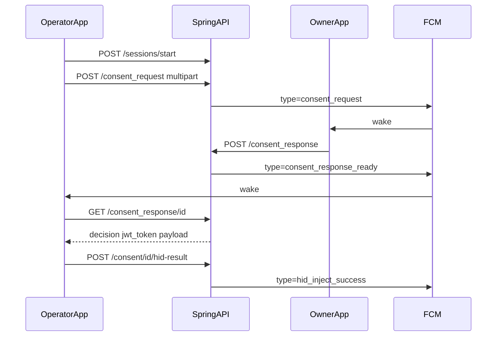

# Ascert.EN — Spring Boot Server Specification (Handoff Document)

**Purpose:** Drop this file into a **new Cursor project** and instruct the agent:  
*"Build the Ascert.EN backend exactly from this spec."*

**Product:** Ascert.EN / DTII — mobile consent + BLE witness device backend for India digital identity demos.

**Audience:** AI coding agent or human implementing a **Java Spring Boot** replacement for the current NestJS server.

**Compatibility target:** Existing Flutter app (`Ascert.EN_Phase1_Mob_App`) must work **without API redesign**. Preserve `/api/v1` paths, auth headers, multipart field names, and JSON fields the app already parses.

**Out of scope for this build:**
- Blanket / whole-day operator pre-approvals (future only — see §16)
- Website / portal
- Changing Firebase / `google-services.json` on the mobile app
- Cloud reseed of production data
- Kafka, Redis, multi-tenant SaaS (unless needed later)

---

## 1. Product roles and mental model

| Role (DB/API string) | UI name | Job |
|----------------------|---------|-----|
| `owner` | Subscriber | Reviews consent requests, approves/rejects, views SER |
| `operator` | Operator | BLE pairs with witness device, creates consent + uploads document, injects PIN after approval |

**Core flow (must never break):**

1. Operator starts BLE session with assigned witness device.
2. Operator creates consent request + document (+ optional geo) → `POST /consent_request`.
3. Server pushes FCM `consent_request` to subscriber (**no secrets**).
4. Subscriber approves/rejects → `POST /consent_response`.
5. Server pushes FCM `consent_response_ready` to operator (**no PIN, no decision JWT**).
6. Operator fetches secrets over TLS → `GET /consent_response/{id}` → `{ decision, jwt_token, payload, txn, reason? }`.
7. Operator relays BLE consent response + optional HID PIN inject; reports `POST /consent/{id}/hid-result`.
8. SER (Subscriber Evidence Record) shows consent-create evidence to subscriber only.



---

## 2. Tech stack (required)

| Layer | Choice |
|-------|--------|
| Language | Java **21** |
| Framework | Spring Boot **3.3+** |
| Web | `spring-boot-starter-web` |
| Security | Spring Security + JWT (Nimbus or jjwt) |
| DB | **PostgreSQL 15+** |
| ORM | Spring Data JPA |
| Schema | **Flyway** only (`ddl-auto=validate`) |
| Validation | Bean Validation (`@Valid`) |
| Files | Local disk `uploads/` + static `/uploads/**` |
| Push | Firebase Admin Java SDK |
| API docs | springdoc-openapi → `/api/docs` |
| Build | Maven |
| Logging | SLF4J + structured fields (`txn`, `consentId`, `sessionId`) |
| Tests | JUnit 5 + Spring Boot Test + MockMvc / Testcontainers Postgres if feasible |

**Package root:** `in.dtii.ascerten`

```
ascert-en-server/
  pom.xml
  src/main/java/in/dtii/ascerten/
    AscertEnApplication.java
    config/           # Security, CORS, OpenAPI, uploads, Firebase, Jackson
    common/           # exceptions, error body, health, clocks
    auth/
    users/
    devices/
    consent/
    audit/
    bledevices/
    sessions/
    bleevents/
    tamper/
    rtcsync/
    notifications/
  src/main/resources/
    application.yml
    application-demo.yml
    db/migration/     # V1__init.sql ...
  uploads/
  README.md
```

---

## 3. Configuration

### Env / properties

| Key | Required | Notes |
|-----|----------|-------|
| `SERVER_PORT` | no | default `3000` or `8080` (document chosen port) |
| `DB_HOST`, `DB_PORT`, `DB_NAME`, `DB_USERNAME`, `DB_PASSWORD` | yes | fail-fast at startup if missing |
| `JWT_SECRET` | yes | fail-fast if missing; ≥32 chars |
| `JWT_EXPIRES_IN` | no | default `24h` for app session JWT |
| `UPLOADS_DIR` | no | default `./uploads` |
| `FCM_PROJECT_ID`, `FCM_CLIENT_EMAIL`, `FCM_PRIVATE_KEY` | soft | if missing, log warn and no-op FCM (app still works via poll) |
| `DEMO_MODE` | no | if true, allow role-only login for demos |
| `SPRING_PROFILES_ACTIVE` | — | `demo` enables seed; never seed cloud blindly |

### Profiles

- `demo` — seed users/devices; permissive CORS; DEMO login helper
- `prod` — no seed, Flyway migrate only, stricter logging, synchronize off

### Startup rules

1. Create uploads directory or exit.
2. Validate JWT + DB config or exit.
3. Flyway migrate before app accepts traffic.
4. FCM init soft-fail.

---

## 4. Optimized database design

### Design principles

1. **PostgreSQL**, `timestamptz` everywhere for timestamps.
2. **snake_case** column names; JPA `@Column(name=...)`.
3. Prefer **UUID** for surrogate PK on high-write tables; keep **human business IDs** (`CST-…`, `TXN-…`, `DTI001`, `USR-001`) as unique indexed columns.
4. **FK constraints** with clear `ON DELETE` (RESTRICT for users/devices; CASCADE only for child rows that cannot exist alone).
5. **CHECK** constraints for enums/status.
6. **Partial unique indexes** where Nest needed them (one active session per `session_id`).
7. Index every filter/join path used by APIs.
8. Do **not** store PIN/JWT in push tables. PIN lives on `users` for Phase-1 demo only (isolate behind `PinService`).
9. SER evidence: store authoritative fields on `consent_requests`; copy snapshot onto `audit_logs` at create time for SER listing (immutable evidence row).

### 4.1 Entity relationship (logical)

```
users 1──* device_assignments *──1 ble_devices ──1 users(owner)
users 1──* consent_requests (as owner)
users 1──* consent_requests (as operator)
ble_devices 1──* ble_characteristics
ble_devices 1──* ble_sessions 1──0..1 device_identity_snapshots
consent_requests 1──* audit_logs (optional FK)
sessions/consents correlated by session_id, consent_id, txn, device_id
ble_event_audit, tamper_events, rtc_sync_events = append-only trails
```

### 4.2 Full schema (Flyway `V1__init.sql` target)

Implement this as the **canonical** schema (cleaner than the legacy Nest incremental patches, but same concepts). If reusing an existing cloud DB, write Flyway migrations that **converge** to this model without destructive reseed.

```sql
-- ========== USERS ==========
CREATE TABLE users (
  id              varchar(32) PRIMARY KEY,          -- USR-001
  email           varchar(255) NOT NULL UNIQUE,
  name            varchar(120) NOT NULL,
  role            varchar(16)  NOT NULL CHECK (role IN ('owner','operator')),
  device_id       varchar(32),                      -- soft link / display
  password_hash   varchar(255) NOT NULL,
  pin             varchar(32),                      -- Phase-1 demo PIN (owner); isolate in PinService
  fcm_token       text,
  apns_token      text,
  platform        varchar(16),
  is_active       boolean NOT NULL DEFAULT true,
  created_at      timestamptz NOT NULL DEFAULT now(),
  updated_at      timestamptz NOT NULL DEFAULT now()
);
CREATE INDEX idx_users_role_active ON users(role) WHERE is_active;

-- ========== BLE DEVICES (witness hardware catalog) ==========
CREATE TABLE ble_devices (
  id                         uuid PRIMARY KEY DEFAULT gen_random_uuid(),
  device_id                  varchar(32) NOT NULL UNIQUE,  -- DTI001
  advertisement_name         varchar(64) NOT NULL,
  service_uuid               varchar(64) NOT NULL,
  protocol_version           varchar(16),
  ble_version                varchar(16),
  tls_version                varchar(16),
  owner_user_id              varchar(32) NOT NULL REFERENCES users(id),
  -- runtime timeouts (seconds) — Flutter config source of truth
  heartbeat_interval_sec     int NOT NULL DEFAULT 5,
  disconnect_sec             int NOT NULL DEFAULT 30,
  consent_decision_normal_sec int NOT NULL DEFAULT 120,
  consent_decision_high_sec  int NOT NULL DEFAULT 60,
  hid_inject_window_sec      int NOT NULL DEFAULT 60,
  rtc_max_drift_ms           int NOT NULL DEFAULT 5000,
  mtu                        int NOT NULL DEFAULT 185,
  is_paired                  boolean NOT NULL DEFAULT false,
  last_rssi                  int,
  battery_pct                int,
  created_at                 timestamptz NOT NULL DEFAULT now(),
  updated_at                 timestamptz NOT NULL DEFAULT now()
);
CREATE INDEX idx_ble_devices_owner ON ble_devices(owner_user_id);

CREATE TABLE ble_characteristics (
  id              uuid PRIMARY KEY DEFAULT gen_random_uuid(),
  ble_device_id   uuid NOT NULL REFERENCES ble_devices(id) ON DELETE CASCADE,
  name            varchar(64) NOT NULL,   -- logical key e.g. device_identity
  uuid            varchar(64) NOT NULL,
  short_code      varchar(16),
  properties      varchar(64),            -- notify,write,read,...
  direction       varchar(32),
  purpose         text,
  UNIQUE (ble_device_id, name)
);

-- ========== ASSIGNMENTS ==========
CREATE TABLE device_assignments (
  id              uuid PRIMARY KEY DEFAULT gen_random_uuid(),
  ble_device_id   uuid NOT NULL REFERENCES ble_devices(id) ON DELETE CASCADE,
  operator_id     varchar(32) NOT NULL REFERENCES users(id),
  assigned_by     varchar(32) REFERENCES users(id),
  is_active       boolean NOT NULL DEFAULT true,
  assigned_at     timestamptz NOT NULL DEFAULT now(),
  revoked_at      timestamptz
);
-- One active assignment per operator (demo rule)
CREATE UNIQUE INDEX uq_assignment_active_operator
  ON device_assignments(operator_id) WHERE is_active;
CREATE INDEX idx_assignment_device_active
  ON device_assignments(ble_device_id) WHERE is_active;

-- ========== BLE SESSIONS ==========
CREATE TABLE ble_sessions (
  id              uuid PRIMARY KEY DEFAULT gen_random_uuid(),
  session_id      varchar(64) NOT NULL,           -- firmware may reuse
  device_id       varchar(32) NOT NULL,           -- DTI001
  operator_id     varchar(32) NOT NULL REFERENCES users(id),
  owner_id        varchar(32) NOT NULL REFERENCES users(id),
  txn             varchar(32),
  fw_version      varchar(64),
  hw_version      varchar(64),
  mac_address     varchar(32),
  ble_version     varchar(16),
  tls_version     varchar(16),
  state           varchar(32) NOT NULL CHECK (state IN (
                    'IDLE','CONSENT_REQUESTED','CONSENT_ACTIVE',
                    'CONSENT_COMPLETED','SESSION_ENDING'
                  )),
  started_at      timestamptz NOT NULL DEFAULT now(),
  ended_at        timestamptz,
  ended_reason    varchar(32) CHECK (
                    ended_reason IS NULL OR ended_reason IN (
                      'COMPLETED','TAMPER','TIMEOUT','ERROR',
                      'DISCONNECTED','ABORTED_BY_USER','OPERATOR_DECLINED'
                    )
                  ),
  notes           text
);
-- Firmware reuses session_id: only ONE active row per session_id
CREATE UNIQUE INDEX uq_ble_sessions_active_session_id
  ON ble_sessions(session_id) WHERE ended_at IS NULL;
CREATE INDEX idx_ble_sessions_device_started ON ble_sessions(device_id, started_at DESC);
CREATE INDEX idx_ble_sessions_operator ON ble_sessions(operator_id, started_at DESC);

CREATE TABLE device_identity_snapshots (
  id              uuid PRIMARY KEY DEFAULT gen_random_uuid(),
  session_pk      uuid NOT NULL UNIQUE REFERENCES ble_sessions(id) ON DELETE CASCADE,
  device_id       varchar(32) NOT NULL,
  mac_address     varchar(32),
  fw_version      varchar(64),
  hw_version      varchar(64),
  ble_version     varchar(16),
  tls_version     varchar(16),
  raw_payload     jsonb,
  captured_at     timestamptz NOT NULL DEFAULT now()
);

-- ========== CONSENT REQUESTS ==========
CREATE TABLE consent_requests (
  id                 uuid PRIMARY KEY DEFAULT gen_random_uuid(),
  consent_id         varchar(64) NOT NULL UNIQUE,   -- CST-...
  txn_ref            varchar(32) NOT NULL UNIQUE,   -- TXN-[0-9A-F]{6}
  title              varchar(255) NOT NULL,
  description        text,
  scope              varchar(16) NOT NULL CHECK (scope IN ('READ','WRITE','READ_WRITE')),
  priority           varchar(16) NOT NULL DEFAULT 'normal'
                       CHECK (priority IN ('normal','high')),
  status             varchar(32) NOT NULL CHECK (status IN (
                       'PENDING_OWNER_APPROVAL','APPROVED','REJECTED',
                       'EXPIRED','TAMPER_ABORTED'
                     )),
  owner_id           varchar(32) NOT NULL REFERENCES users(id),
  operator_id        varchar(32) NOT NULL REFERENCES users(id),
  device_id          varchar(32) NOT NULL,
  session_id         varchar(64),
  -- attachments
  attachment_name    varchar(255),
  attachment_url     text,
  attachment_hash    varchar(80),          -- SHA256:...
  -- decision timing (server authority)
  created_at         timestamptz NOT NULL DEFAULT now(),
  decision_deadline_ms bigint NOT NULL,    -- epoch ms
  approved_at        timestamptz,
  rejected_at        timestamptz,
  aborted_reason     varchar(64),
  decision_reason    text,
  delivery           varchar(64) DEFAULT 'FCM · BLE relay',
  -- SER geo (operator at create time)
  operator_latitude  double precision,
  operator_longitude double precision,
  operator_location_accuracy double precision,
  operator_location_captured_at timestamptz,
  operator_street    text,
  operator_city      varchar(120),
  operator_state     varchar(120),
  operator_postal_code varchar(32)
);
CREATE INDEX idx_consent_owner_created ON consent_requests(owner_id, created_at DESC);
CREATE INDEX idx_consent_operator_created ON consent_requests(operator_id, created_at DESC);
CREATE INDEX idx_consent_status_deadline ON consent_requests(status, decision_deadline_ms)
  WHERE status = 'PENDING_OWNER_APPROVAL';
CREATE INDEX idx_consent_session ON consent_requests(session_id)
  WHERE session_id IS NOT NULL;
-- At most one PENDING consent per session (demo rule)
CREATE UNIQUE INDEX uq_consent_pending_per_session
  ON consent_requests(session_id)
  WHERE status = 'PENDING_OWNER_APPROVAL' AND session_id IS NOT NULL;

-- ========== GOVERNANCE AUDIT + SER SNAPSHOT ==========
CREATE TABLE audit_logs (
  id                 uuid PRIMARY KEY DEFAULT gen_random_uuid(),
  action             varchar(255) NOT NULL,
  detail             text,
  type               varchar(16) NOT NULL CHECK (type IN ('approve','reject','login','ble','system')),
  actor_id           varchar(32),
  actor_role         varchar(32),
  actor_name         varchar(120),
  -- correlation
  consent_id         varchar(64),
  txn                varchar(32),
  session_id         varchar(64),
  device_id          varchar(32),
  consent_request_id uuid REFERENCES consent_requests(id) ON DELETE SET NULL,
  -- SER snapshot (immutable copy at consent-create)
  document_name      varchar(255),
  attachment_hash    varchar(80),
  file_url           text,
  latitude           double precision,
  longitude          double precision,
  location_accuracy  double precision,
  street             text,
  city               varchar(120),
  state              varchar(120),
  postal_code        varchar(32),
  created_at         timestamptz NOT NULL DEFAULT now()
);
CREATE INDEX idx_audit_created ON audit_logs(created_at DESC);
CREATE INDEX idx_audit_type ON audit_logs(type, created_at DESC);
CREATE INDEX idx_audit_ser ON audit_logs(document_name)
  WHERE document_name IS NOT NULL;
CREATE INDEX idx_audit_consent ON audit_logs(consent_id) WHERE consent_id IS NOT NULL;

-- ========== PROTOCOL TRAIL ==========
CREATE TABLE ble_event_audit (
  id              bigserial PRIMARY KEY,          -- monotonic order
  event_type      varchar(64) NOT NULL,
  direction       varchar(16) NOT NULL CHECK (direction IN (
                    'APP_TO_FW','FW_TO_APP','APP_TO_BE','BE_TO_APP'
                  )),
  session_id      varchar(64),
  consent_id      varchar(64),
  txn             varchar(32),
  device_id       varchar(32),
  actor_id        varchar(32) NOT NULL,           -- ALWAYS from JWT, never body
  payload_summary jsonb,
  error_code      varchar(64),
  retry_count     int NOT NULL DEFAULT 0,
  recorded_at     timestamptz NOT NULL DEFAULT now()
);
CREATE INDEX idx_ble_event_session ON ble_event_audit(session_id, id DESC);
CREATE INDEX idx_ble_event_recorded ON ble_event_audit(recorded_at DESC);

CREATE TABLE tamper_events (
  id              uuid PRIMARY KEY DEFAULT gen_random_uuid(),
  device_id       varchar(32) NOT NULL,
  session_id      varchar(64),
  consent_id      varchar(64),
  reported_by     varchar(32) NOT NULL DEFAULT 'app',
  notes           text,
  detected_at     timestamptz NOT NULL,
  resolved        boolean NOT NULL DEFAULT false,
  created_at      timestamptz NOT NULL DEFAULT now()
);
CREATE INDEX idx_tamper_device ON tamper_events(device_id, detected_at DESC);

CREATE TABLE rtc_sync_events (
  id                 uuid PRIMARY KEY DEFAULT gen_random_uuid(),
  device_id          varchar(32) NOT NULL,
  operator_id        varchar(32) NOT NULL,
  session_id         varchar(64),
  old_timestamp_ms   bigint NOT NULL,
  new_timestamp_ms   bigint NOT NULL,
  drift_ms           bigint NOT NULL,             -- abs(new-old)
  created_at         timestamptz NOT NULL DEFAULT now()
);
CREATE INDEX idx_rtc_device ON rtc_sync_events(device_id, created_at DESC);
```

### 4.3 Optional later tables (do not build now)

- `blanket_approvals` (owner → operator, valid_from/valid_to, scope) — §16
- `documents` S3 metadata (current path is local disk only)

---

## 5. Security rules (hard)

1. **Never** put owner PIN or decision JWT in FCM payloads. FCM is wake-only.
2. App session JWT claims: `sub` (user id), `email`, `role`, `deviceId`, `name`. Header: `Authorization: Bearer <token>`.
3. Decision JWT (separate, short-lived **5 minutes**): claims `consent_id`, `txn`, `device_id`, `operator_id`, `decision`, `iat`. Returned only from `GET /consent_response/{id}` when approved.
4. Party isolation: only consent `owner_id` / `operator_id` may read or act on that consent.
5. Device **owner** is taken from `ble_devices.owner_user_id`, never trusted from client `owner_id` alone (client may send it; server overwrites/validates).
6. Consent create: JWT user must be `operator`, must match `operator_id`, must have **active** `device_assignments` for that device.
7. Strip `password_hash`, `fcm_token`, `apns_token`, `pin` from all public JSON responses (PIN only inside `GET /consent_response` as `payload`).
8. `actor_id` on ble-events is set from JWT server-side — ignore body actor.
9. Decision deadline is server-authoritative (`decision_deadline_ms`); reject late decisions.
10. Tamper cascade must be **transactional**: insert tamper → abort open consents → end active sessions → best-effort ble event.
11. Telemetry helpers (`audit`, `ble-events`) must be **fail-soft** — never fail the parent business operation.
12. Upload: max **10 MB**; allow `.pdf,.jpg,.jpeg,.png,.doc,.docx`; multipart field name **`document`**.

### Role matrix

| Endpoint family | owner | operator |
|-----------------|-------|----------|
| Create consent | no | yes |
| Decide consent | yes | no |
| GET consent response (PIN/JWT) | party | party |
| SER / audit UI usage | yes (app hides from operator) | API may still auth; app redirects |
| BLE assign | yes | no |
| Sessions / HID / RTC | rare | yes |

Use `@PreAuthorize("hasRole('OWNER')")` etc. Map JWT `role` → `ROLE_OWNER` / `ROLE_OPERATOR`.

---

## 6. API contract (global prefix `/api/v1`)

Jackson: accept unknown properties loosely on input where needed; prefer stable output the Flutter app already parses. Support **both camelCase and snake_case** on inbound consent create fields.

Public (no JWT): `POST /auth/login`, `GET /health`, static `/uploads/**`, OpenAPI `/api/docs`.

### 6.1 Auth

**`POST /auth/login`**
```json
// request (prod)
{ "email": "subscriber@dtii.in", "password": "..." }
// request (demo helper if DEMO_MODE)
{ "role": "owner" }

// response
{
  "token": "<jwt>",
  "user": {
    "id": "USR-001",
    "email": "subscriber@dtii.in",
    "name": "DTII SUBSCRIBER",
    "role": "owner",
    "deviceId": "DTI001"
  }
}
```

**`POST /auth/logout`** → `{ "success": true }` (stateless JWT; optional blacklist later)

**`GET /users/me`** → user object without secrets

### 6.2 Devices (phone push registration)

**`POST /devices/register`**
```json
{ "fcmToken": "...", "platform": "android" }
```
Store on `users.fcm_token` / `platform` for the JWT user.

**`GET /devices`** → list as needed for demo (can return current user’s registration info).

### 6.3 Consent

**`POST /consent_request`** (operator, JSON **or** multipart)

Multipart file field: **`document`**.

Body fields (snake_case preferred from Flutter):
- required: `txn`, `consent_id`, `device_id`, `operator_id`, `title`, `scope`
- optional: `owner_id`, `description`, `priority` (`normal`|`high`), `expires_at`, `session_id`
- attachment: `attachment_name`, `attachment_hash` (`SHA256:...`), `attachment_url`
- geo: `latitude`, `longitude`, `location_accuracy`, `location_captured_at`, `street`, `city`, `state`, `postal_code`

Validation:
- `txn` matches `TXN-[0-9A-F]{6}`
- scope ∈ `READ|WRITE|READ_WRITE`
- active assignment; owner from device row
- ≤1 pending consent per `session_id`
- `decision_deadline_ms = now + device.consent_decision_*_sec * 1000` by priority
- verify upload hash when file present (warn on mismatch; prefer not hard-fail demo)

On success: persist consent + SER geo; write `audit_logs` SER snapshot (`document_name` = attachment name); FCM owner `consent_request`; ble event `CONSENT_REQUESTED`.

**`POST /consent_response`** (owner)
```json
{ "consent_id": "<uuid or CST-...>", "decision": "approved"|"rejected", "reason": "optional" }
```
Enforce deadline; update status; FCM operator `consent_response_ready` with **only** ids (no pin/jwt).

**`GET /consent_response/{consentId}`** (party)
```json
{
  "decision": "approved"|"rejected"|null,
  "jwt_token": "...",
  "payload": "<owner pin or structured pin payload>",
  "txn": "TXN-......",
  "reason": "..."
}
```
If still pending → `decision: null` (or omit) so Flutter polling continues.

**`GET /consent`** — list for current role (owner sees theirs; operator sees theirs).

**`GET /consent/{id}`** — detail; resolve by UUID **or** `consent_id` (CST-…). Include fields Flutter parses:
`id`, `txnRef`, `consentId`/`consent_id`, `title`, `status`, owner/operator, `scope`, `priority`, `description`, attachment fields, `createdAt`/`createdAtMs`, `serverNowMs`, `decisionDeadlineMs`, geo fields, `abortedReason`.

**`POST /consent/{id}/abort`**
```json
{ "reason": "OPERATOR_DECLINED"|"REQUEST_EXPIRED"|"TAMPER_DETECTED"|... }
```

**`POST /consent/{id}/hid-result`** (operator)
```json
{ "status": "success", "used_at": 1710000000000 }
```
On success → FCM owner `hid_inject_success`.

### 6.4 BLE devices

- `GET /ble-devices`
- `GET /ble-devices/{deviceId}`
- `GET /ble-devices/{deviceId}/config` — **critical for Flutter**
  - top-level camelCase: `deviceId`, `advertisementName`, `serviceUuid`, versions, `timeouts{...}`, `ownerInfo`, `operatorInfo`
  - `characteristics` map keys **snake_case**: `device_identity`, `device_status`, `rtc_sync`, `session_announce`, consent/hid chars, etc.
- `PATCH /ble-devices/{deviceId}/status` → `{ isPaired?, rssi?, batteryPct? }`
- `POST /ble-devices/{deviceId}/assign` (owner)
- `DELETE /ble-devices/{deviceId}/assign/{operatorId}` (owner)

### 6.5 Sessions

**`POST /sessions/start`**
```json
{
  "sessionId": "...",
  "deviceId": "DTI001",
  "operatorId": "USR-002",
  "ownerId": "USR-001",
  "txn": "...",
  "fwVersion": "...",
  "hwVersion": "...",
  "macAddress": "...",
  "bleVersion": "...",
  "tlsVersion": "..."
}
```
Idempotent if same `sessionId` still open; else end other active session on device; create identity snapshot in one transaction.

- `GET /sessions/{sessionId}`
- `PATCH /sessions/{sessionId}/state` → `{ "state": "CONSENT_REQUESTED"|... }` with legal transitions only
- `POST /sessions/{sessionId}/end` → `{ "reason": "COMPLETED"|..., "notes": "..." }`

### 6.6 Events / tamper / RTC / audit

**`POST /ble-events`**
```json
{
  "eventType": "...",
  "sessionId": "...",
  "consentId": "...",
  "txn": "...",
  "direction": "APP_TO_BE",
  "payloadSummary": {},
  "errorCode": "...",
  "deviceId": "...",
  "retryCount": 0
}
```

**`GET /ble-events?sessionId=&limit=50`** — normalize to audit-like rows with `type: "ble"` for Flutter merge.

**`POST /tamper-events`**
```json
{
  "deviceId": "DTI001",
  "reportedBy": "app",
  "detectedAt": "2026-08-12T10:00:00Z",
  "sessionId": "...",
  "consentId": "...",
  "notes": "..."
}
```

**`POST /rtc-corrections`**
```json
{
  "deviceId": "DTI001",
  "operatorId": "USR-002",
  "oldTimestampMs": 1,
  "newTimestampMs": 2,
  "sessionId": "..."
}
```

**`GET /audit?filter=all|consent|ble|auth|ser&limit=50`**
- `ser` → rows where `document_name IS NOT NULL`
- Include nested `consentRequest { title, ... }` when available so Flutter list can show **title** and detail can show **document name**

### 6.7 Health

**`GET /health`**
```json
{
  "status": "ok",
  "service": "ascert-en",
  "version": "2.0.0",
  "database": "up",
  "timestamp": "..."
}
```
If DB down → HTTP **503**, `database: "down"`.

---

## 7. FCM message contracts

| `data.type` | Target | Required data fields | Secrets? |
|-------------|--------|----------------------|----------|
| `consent_request` | owner | `consent_id` (and/or `consentId`) | **no** |
| `consent_response_ready` | operator | `consent_id` | **no** |
| `hid_inject_success` | owner | consent/document refs as needed | **no** |

Also send notification title/body for OS tray. Android channel id used by app: `ascent_en_consent`.

Record `FCM_PING_SENT` in `ble_event_audit` best-effort.

---

## 8. Background jobs

- **Every 60s:** expire `PENDING_OWNER_APPROVAL` where `decision_deadline_ms < nowMs` → status `EXPIRED`, audit + optional FCM.
- Use Spring `@Scheduled` with single-node assumption for demo (document shedlock if multi-instance later).

---

## 9. Error responses

Consistent JSON:
```json
{
  "statusCode": 400,
  "message": "Human-safe message",
  "error": "Bad Request",
  "timestamp": "..."
}
```
Map domain exceptions:
- 401 unauthorized / bad login
- 403 forbidden (wrong role/party)
- 404 not found
- 409 conflict (duplicate txn, pending consent exists, illegal state transition)
- 422 validation
- 500 unexpected (no stack traces to clients)

---

## 10. Demo seed (`demo` profile only)

Seed **without** wiping cloud accidentally. On empty DB or explicit `SEED_ON_START=true`:

| User | Role | Suggested PIN | Device |
|------|------|---------------|--------|
| USR-001 | owner | 11111111 | DTI001 |
| USR-002 | operator | — | assigned DTI001 |
| USR-003 | owner | 22222222 | DTI002 |
| USR-004 | operator | — | assigned DTI002 |
| USR-005 | owner | 33333333 | DTI003 |
| USR-006 | operator | — | assigned DTI003 |

Also seed: 3 `ble_devices` + characteristics map matching Flutter expected keys, active assignments, optional sample consents.

**Never** run seed against shared cloud without explicit confirmation.

---

## 11. Optimized server practices (required quality bar)

1. Constructor injection; no field injection.
2. Controllers thin; services own transactions (`@Transactional`).
3. DTOs in/out — never return JPA entities raw.
4. Idempotent session start; optimistic conflict handling on unique indexes.
5. Connection pool tuned (HikariCP defaults OK for demo; document max pool).
6. Request logging interceptor with correlation ids.
7. Global exception handler.
8. OpenAPI annotations for every endpoint.
9. Integration tests for:
   - login → register device
   - consent create → decide → get response contains pin/jwt
   - FCM payload builder never includes pin/jwt (unit test)
   - party isolation 403
   - late decision rejected
   - SER audit filter returns document_name rows
10. README: how to run Postgres, Flyway, seed, point Flutter `BASE_URL`.

---

## 12. Flutter compatibility checklist (acceptance)

Operator phone:
- [ ] Login
- [ ] Load `/ble-devices/{id}/config`
- [ ] Start session
- [ ] Create consent with document + geo
- [ ] Receive/poll decision; GET response yields `jwt_token` + `payload`
- [ ] HID result posts successfully

Subscriber phone:
- [ ] Login
- [ ] FCM or list shows consent
- [ ] Approve/reject
- [ ] SER list shows **title** (from consent), detail shows **document name**
- [ ] SER download still works against `/audit?filter=ser`

Security smoke:
- [ ] No PIN/JWT in any FCM data map
- [ ] Operator cannot call decide endpoint
- [ ] Unassigned operator cannot create consent for device

---

## 13. Implementation order

1. Skeleton: Boot, Security JWT, health, CORS, OpenAPI, exception handler, Flyway V1 schema  
2. Auth + users + devices/register  
3. BLE devices + characteristics + config + assignments  
4. Sessions + identity snapshot + state machine  
5. ble-events + tamper + RTC  
6. Consent create + uploads + SER audit snapshot + FCM consent_request  
7. Consent decide + GET response (JWT+PIN) + FCM consent_response_ready  
8. Abort + hid-result + expiry scheduler  
9. Audit filters + demo seed + E2E against Flutter  
10. Harden tests + README  

---

## 14. Mapping from NestJS (reference only)

Legacy repo: `Ascert.EN_Mob_App_Server-` (NestJS + TypeORM).  
This Spring server should be a **better rewrite**, not a line-by-line port. Preserve **behavior and API**, improve **schema clarity, transactions, typing, and ops**.

Do not require Nest code at runtime. Use this document as source of truth.

---

## 15. Files / uploads

- Save as `{epochMillis}-{random}{ext}` under `UPLOADS_DIR`
- Public URL path: `/uploads/{filename}`
- Persist `attachment_url` as `/uploads/{filename}` (Flutter prefixes host by stripping `/api/v1` from BASE_URL)

---

## 16. Future work (DO NOT IMPLEMENT NOW)

**Blanket / whole-day approvals** (deferred):

> Subscriber grants an operator approval for a calendar day (or time window) + optional scope. Matching `POST /consent_request` would auto-transition to `APPROVED` and skip owner review, still writing SER + issuing decision JWT/PIN via the same GET path.

Suggested future table (not created now):
```sql
-- FUTURE ONLY
-- blanket_approvals (
--   id, owner_id, operator_id, device_id nullable,
--   scope, valid_from, valid_to, revoked_at, created_at
-- )
```

---

## 17. Agent kickoff prompt (copy-paste into new project)

```
Build the Ascert.EN backend from ASCERT_EN_SPRING_BOOT_SERVER_SPEC.md.

Requirements:
- Java 21 + Spring Boot 3.3+, Maven, PostgreSQL, Flyway, Spring Security JWT
- Exact /api/v1 contract so the existing Flutter app works unchanged
- Optimized schema as specified (timestamptz, indexes, partial uniques, CHECKs)
- Never put PIN or decision JWT in FCM
- Fail-soft audit/telemetry; transactional tamper/session/consent paths
- demo profile seed only
- Do NOT implement blanket/whole-day approvals
- Do NOT modify Firebase mobile config
- Deliver README + OpenAPI + the acceptance checklist green for happy path
```

---

## 18. Document control

| Field | Value |
|-------|-------|
| Spec version | 1.0 |
| Date | 2026-08-12 |
| Status | Ready for new Spring Boot project |
| Blanket approvals | Explicitly deferred |
| Mobile BASE_URL today | `https://test.tbls.in/dtii-api/api/v1` (swap when Spring is ready) |

**End of specification.**
